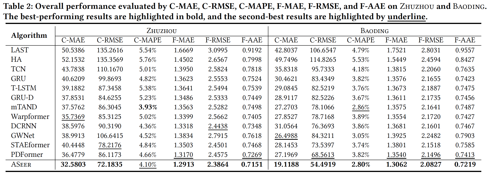

This is the official implementation of **KDD 24** paper [*Irregular Traffic Time Series Forecasting Based on Asynchronous Spatio-Temporal Graph Convolutional Networks*](https://dl.acm.org/doi/10.1145/3637528.3671665).

## New Benchmark and Datasets

We meticulously collect and develop two novel real-world datasets of irregular traffic time series, and establish a systematic evaluation scheme comprising six metrics, setting a new benchmark in the field of **irregular traffic forecasting**.

Datasets are available at the provided [dataset link](https://drive.google.com/drive/folders/1BPo5GczJd6OENZp-VgFVQ-Oo-wqC9GPT?usp=drive_link), where the files for each dataset represents:

*dataset_onhour.pkl*: (x, y, mask_x, mask_y) 
- x fields: end time of cycle, cycle length, traffic flow, unit traffic flow <br>
- y fields: begin time of cycle, cycle length, traffic flow, unit traffic flow <br>
- mask_x: mask terms of x <br>
- mask_y: mask terms of y <br>

*distance_geo.npy*: pair-wise geographical distance between sensors. <br>
*reachability.npy*: pair-wise lane-level road network reachability between sensors. 


More detailed analysis on the datasets can be found in the paper [Appendix A.1 Data Description and Analysis](https://dl.acm.org/doi/pdf/10.1145/3637528.3671665).

**The main results**:

<!---->
<p align="center">
  
</p>


## Requirements

ASeer has been tested using Python 3.8.8.

To have consistent libraries and their versions, you can install the needed dependencies for this project by running the following command:

```shell
pip install -r requirements.txt
```

## Run the Model
Take dataset ZHUZHOU as an example.

You need to first execute the below command to generate the asynchronously diffused message edges for the dataset:  

```shell
python ./lib/message_edges_gen.py zhuzhou
```

To replicate the experimental results presented in the paper, please execute the below script:

```shell
sh ./scripts/zhuzhou.sh
```

## Citation

```shell
@inproceedings{10.1145/3637528.3671665,
author = {Zhang, Weijia and Zhang, Le and Han, Jindong and Liu, Hao and Fu, Yanjie and Zhou, Jingbo and Mei, Yu and Xiong, Hui},
title = {Irregular Traffic Time Series Forecasting Based on Asynchronous Spatio-Temporal Graph Convolutional Networks},
year = {2024},
booktitle = {Proceedings of the 30th ACM SIGKDD Conference on Knowledge Discovery and Data Mining},
pages = {4302–4313}
}
```
